# FrameWork-Programming

Session 1:
In the first section we dealt with components and layout.

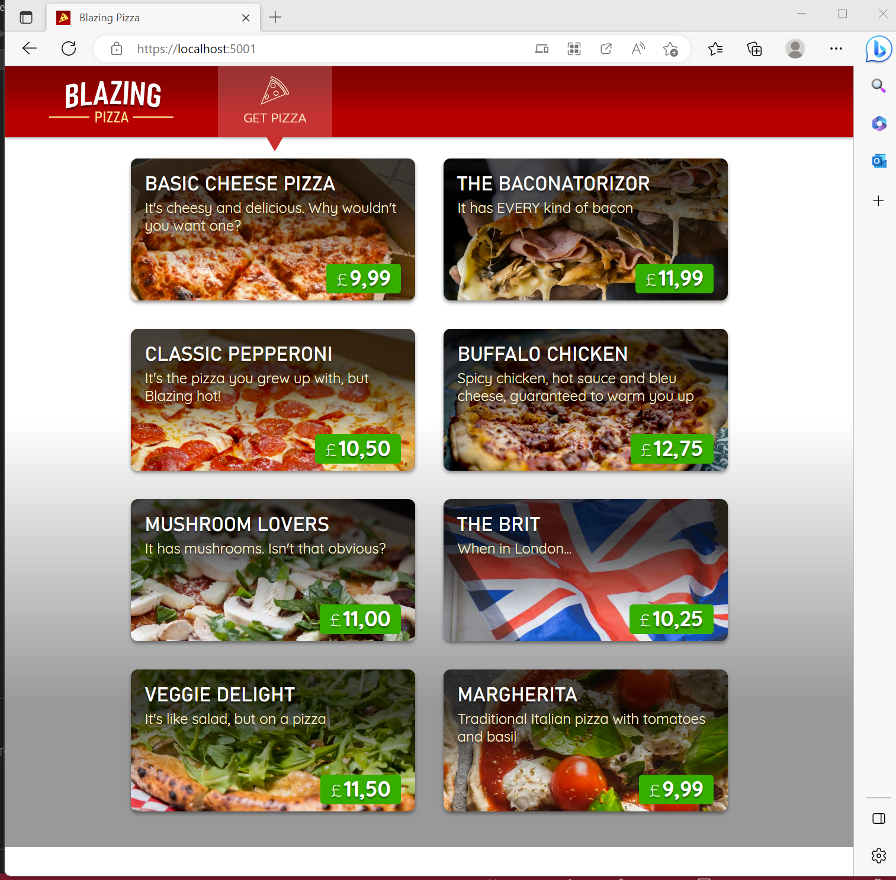

Session 2:
In the second session, we updated the pizza app to allow users to customize their pizzas and add them to their order.

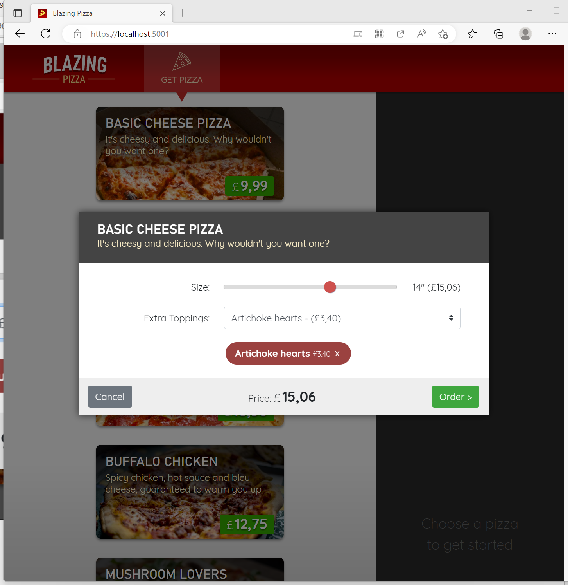

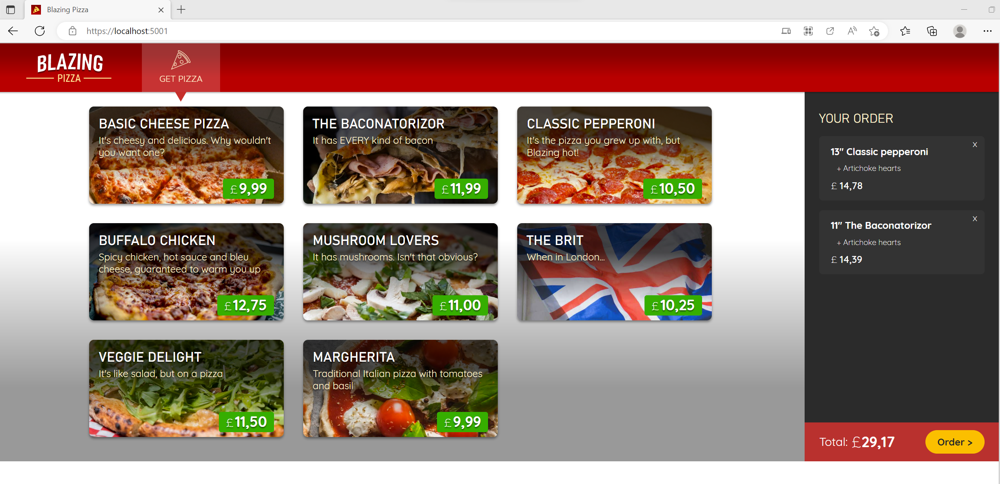

Session 3:
We can order pizzas, however we cannot see the status of orders. In Session 3, you will set up a page called “My Orders” that displays multiple orders, as well as an “Order Details” view showing the content and status of an individual order.

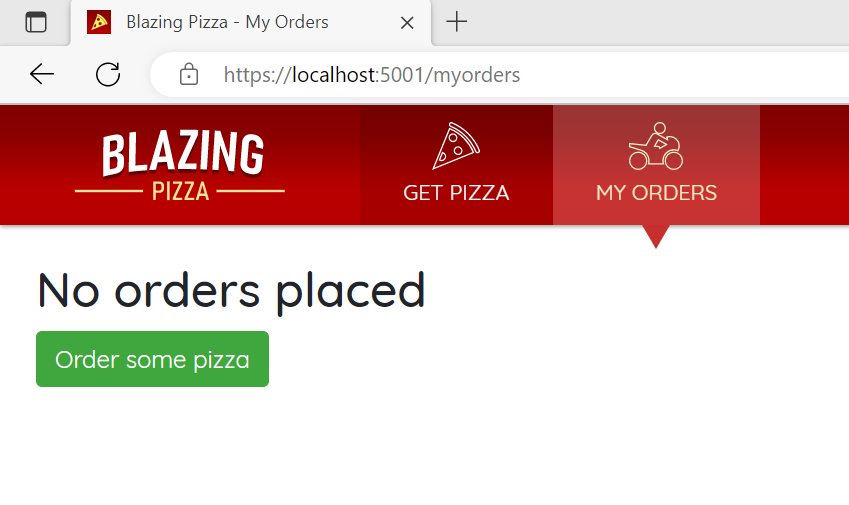

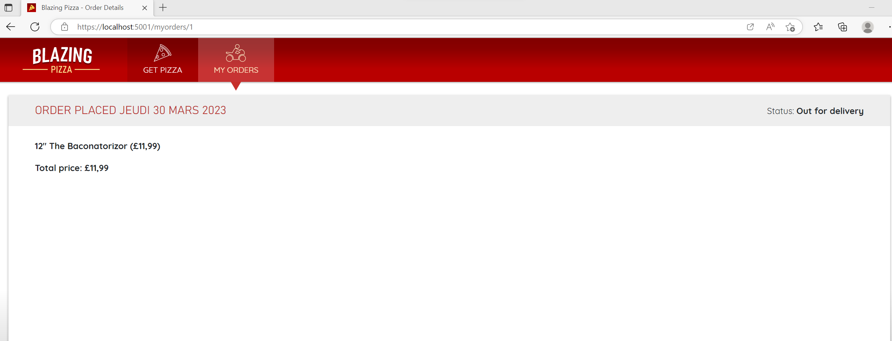

Session 4:
In Session 4, we'll review some of the code we've already written and try to make it more enjoyable. We'll also talk more about events and how events cause the UI to update. This part is used to improve our work but it does not add any additional functionality.

Session 5:
In session 5, we created a page called “payment” that requires customers to enter a valid address.

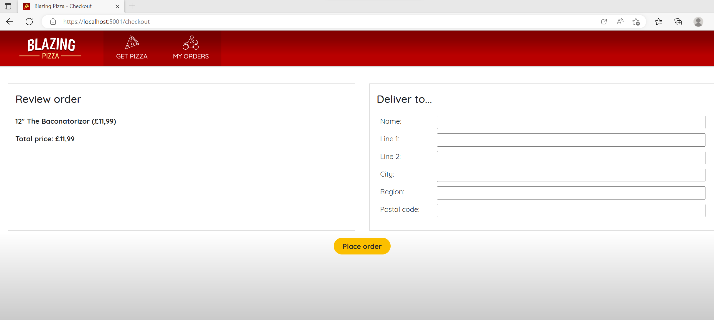

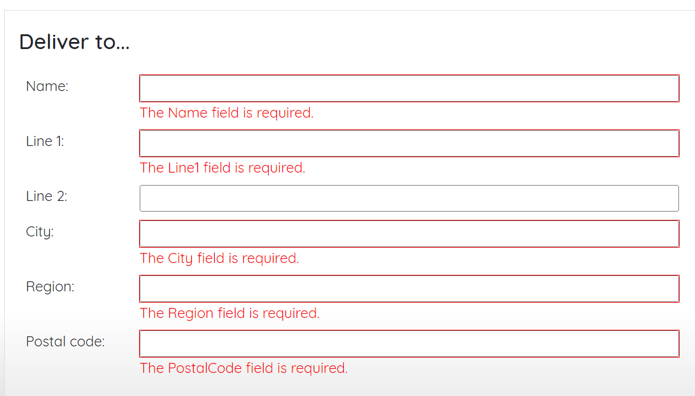

Session 6:
In session 6, we created a way for users to log in, so we know who is who. Then we can implement authorization, which is enforcing rules about who is allowed to do what.

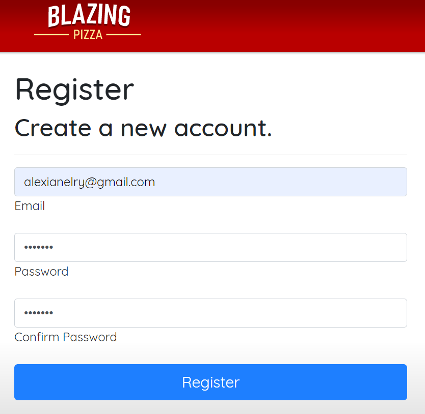

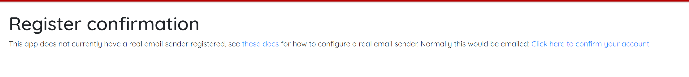

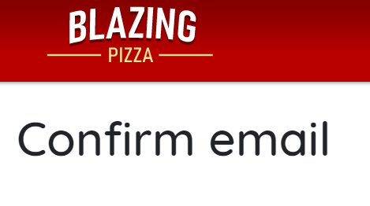

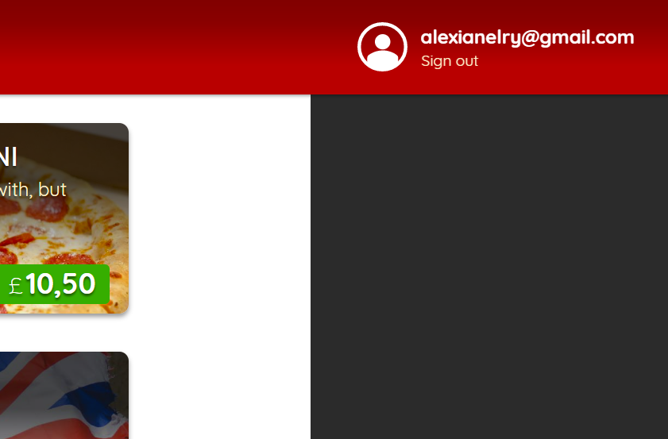

Session 7:
In session 7, pizzeria users can now track the status of their orders in real time. We used JavaScript Interop to add a real-time map to the order status page that answers the age-old question, "Where's my pizza?!?".

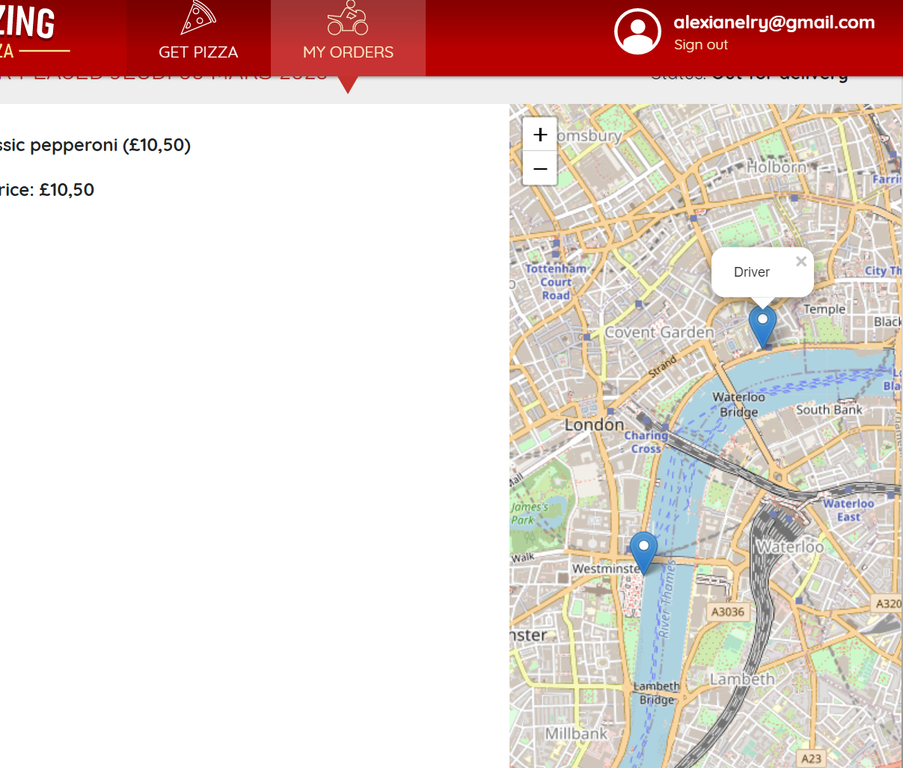

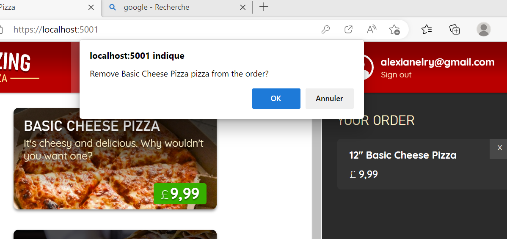

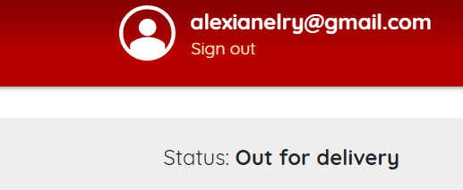

Session 8:
Let's refactor some of the original components and make them more reusable. Along the way, we'll also create a separate library project as a location for the new components. We will create a new project using the Razor Class Library template. This part is used to improve our work but it does not add any additional visual functionality.

Session 9:
In the last part using the Progressive Web App (PWA) we were able to add a service worker, make our application installable, send push notifications, get a subscription, send a notification, show notifications and finally manage clicks on the notifications.

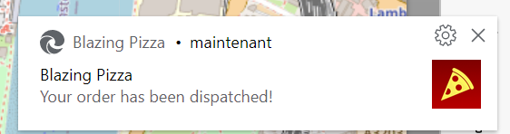

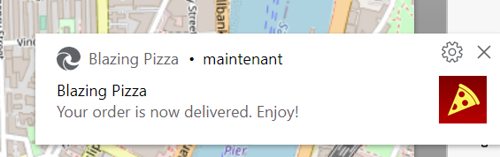

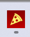

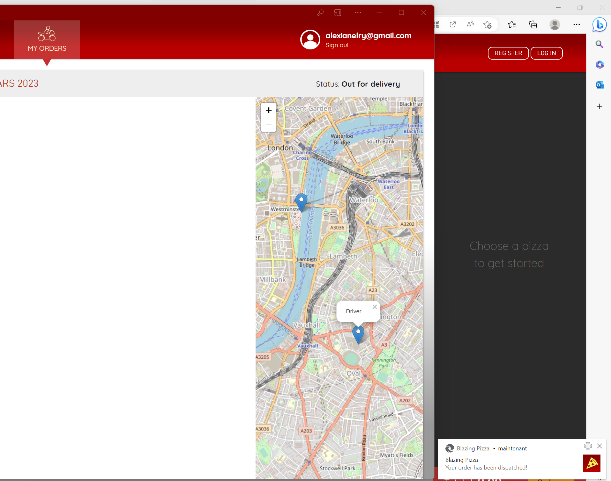
