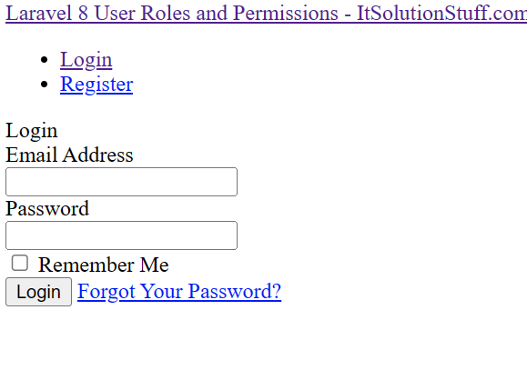
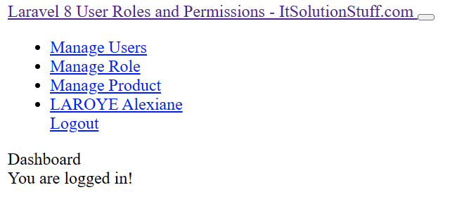
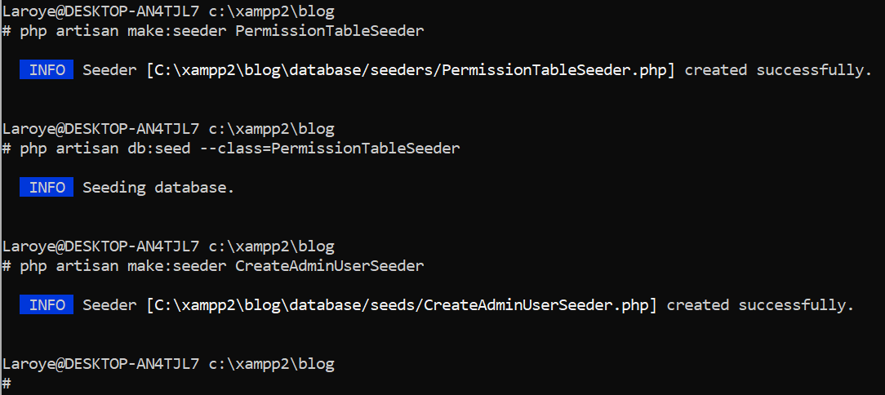
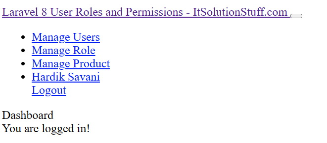

# FrameWork-Programming

Explanation of the application based on Clean Architecture:

1. What entities/models are involved in the application?

2. Application use cases. Format: <Role type> can perform <a feature>

3. Controllers, Middleware, and additional libraries used and their 
respective functions

4. DB, external interfaces: database table structure used.

Pictures:

